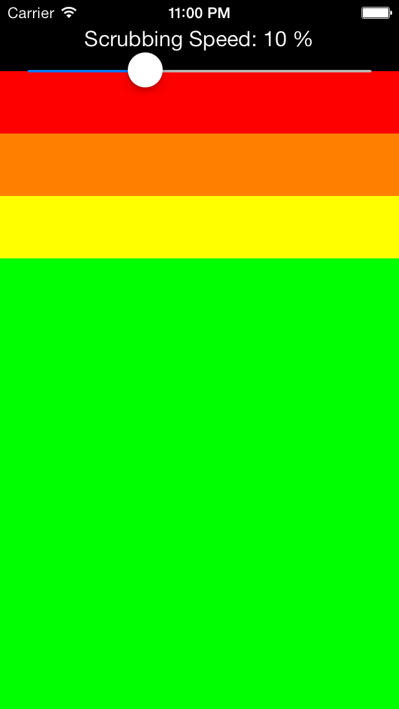

<h1>JGDetailScrubber</h1><h6>© 2013 Jonas Gessner</h6>

----------------
<br>

JGDetailScrubber is a UISlider subclass with variable scrubbing speeds, similar to the private class MPDetailScrubber.

<p align="center"></p>

##Requirements

• Base SDK: iOS 7.0 or higher<br>
• Deployment Target: iOS 5.0 or higher<br>
• Built with <b>ARC</b> (If your Xcode project doesn't use ARC then set the `-fobjc-arc` compiler flag)<br>
• Foundation, UIKit and CoreGraphics frameworks<br>


##Usage

JGDetailScrubber works like a normal UISlider, with the addition of variable scrubbing speeds for fine adjusting the slider value.

```objc
@property (nonatomic, strong) NSDictionary *scrubbingSpeeds;
```

Use this property to set up scrubbing. The dictionary contains the Y-offsets from the slider as keys for the scrubbing speeds. The default value of is:

```objc
@{@(0.0f)   : @(1.0f),
  @(50.0f)  : @(0.5f),
  @(100.0f) : @(0.25f),
  @(150.0f) : @(0.1f)};
```

<br>
<br>

```objc
@property (nonatomic, assign, readonly) CGFloat currentScrubbingSpeed;
```
Returns the current scrubbing speed. If tracking is `NO` then the returned value will be `0.0f`.


```objc
@property (nonatomic, assign, readonly) BOOL scrubbing;
```
Returns `YES` if the scrubber is currently scrubbing and `NO` if it isn't.

<br>
###JGDetailScrubberDelegate

```objc
@property (nonatomic, weak) id <JGDetailScrubberDelegate> delegate;
```


<br>
`JGScrubberDelegate` has one (optional) method:

```objc
- (void)scrubber:(JGDetailScrubber *)slider didChangeToScrubbingSpeed:(CGFloat)speed;
```
This method is called whenever the scrubber's `currentScrubbingSpeed` changes.


##Credits

Created by Jonas Gessner.

##License

JGDetailScrubber is available under the MIT license.
